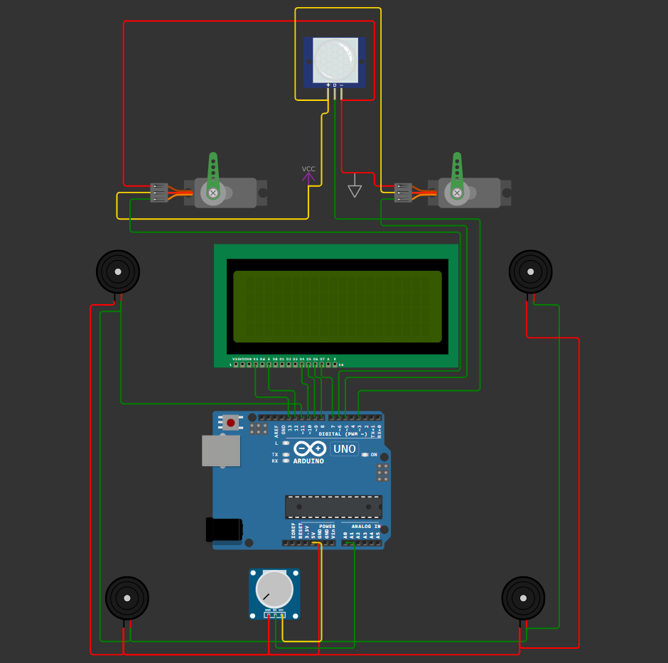

In this project, an entrance door has been implemented, which is adjusted to the required value using a potentiometer.

The motion sensor detects movement using infrared waves and the door opens to the required amount, and at the same time, the Godfather music is played and an animation is played on the screen, and finally the logo is displayed.

<video controls src='./Wokwi.mp4'></video>

in wokwi website :  [click here](https://wokwi.com/projects/419164311819808769)
