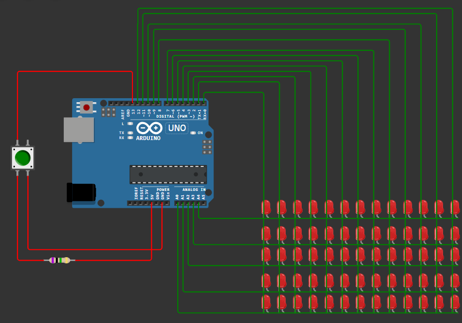
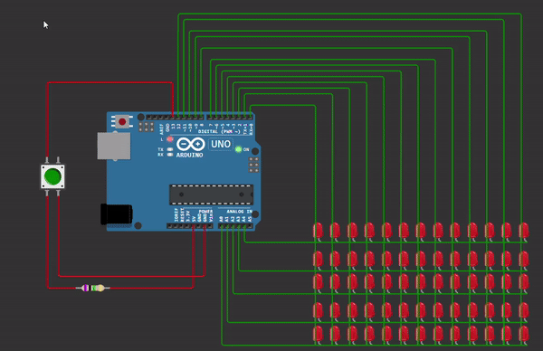

In this project, the LEDs are connected in a matrix with the cathodes in columns and the anodes in rows (it can also be the other way around).

By applying voltage to specific rows and columns, a letter is displayed that moves from left to right with increasing speed using delay and speed, and the number of turns can be determined using the defined cycle. The LEDs can also be reset using the button.

in wokwi website :  [click here](https://wokwi.com/projects/410380345872274433)
